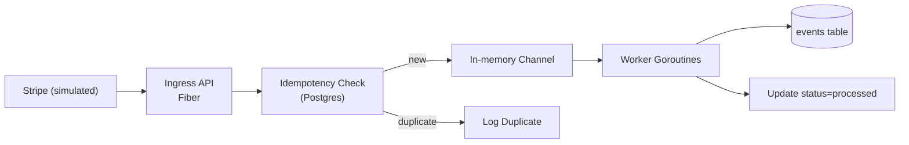

# Reliable Webhook Ingestion & Replay Service (Starter Slice)

> Initial vertical slice: ingest Stripe-like webhook → idempotent store → async processing → status update.

## Client Analogue
A SaaS receiving Stripe & GitHub webhooks; needs to eliminate silent drops and duplicated processing.

## Current Scope (Milestone 1)
- Fiber HTTP server
- `/healthz` and `/readyz`
- `POST /webhooks/stripe`
- Idempotency via `events` table unique constraint on `(provider, event_id)`
- Background worker processes new events (dummy handler sets status=processed)
- Graceful shutdown drains queue
- Docker Compose with Postgres
- Migration v1

## Upcoming Iterations
| Iteration | Feature |
|-----------|---------|
| 2 | Real Stripe signature verification |
| 3 | Retry semantics + DLQ table |
| 4 | Metrics (Prometheus/OpenTelemetry) |
| 5 | Replay CLI + endpoint |
| 6 | Redis cache for hot duplicate suppression |
| 7 | Structured tracing (OpenTelemetry) |
| 8 | Multi-provider abstraction |

## Architecture (Current Slice)



## Run Locally

```bash
docker compose up -d
make migrate-up
go run ./cmd/api
```

Send a test event:

```bash
curl -X POST http://localhost:8080/webhooks/stripe \
  -H "Content-Type: application/json" \
  -H "Stripe-Signature: t=123,v1=dummy" \
  -d '{"id":"evt_test_123","type":"invoice.paid","data":{"object":{"foo":"bar"}}}'
```

Check DB:

```sql
SELECT id, provider, event_id, status, created_at, processed_at FROM events;
```

## Event Lifecycle
1. HTTP receive
2. (Future) Signature verify
3. Extract `event_id` (JSON path `id`)
4. Insert row (status = `received`)
5. Enqueue internal channel
6. Worker loads newest unprocessed, marks `processing`, does handler logic, sets `processed`

## Migrations
See `migrations/0001_init.sql`.

## Config
Environment variables:
- `DB_URL`
- `PORT` (default 8080)
- `STRIPE_SIGNING_SECRET` (placeholder)
- `GRACEFUL_TIMEOUT_SECONDS` (default 10)

## Testing Ideas (Next)
- Unit: extraction & repository idempotency
- Integration: POST → DB row
- Concurrency test: multiple duplicate posts result in single row

## License / Disclaimer
This is an educational reference; NOT production-ready security.
